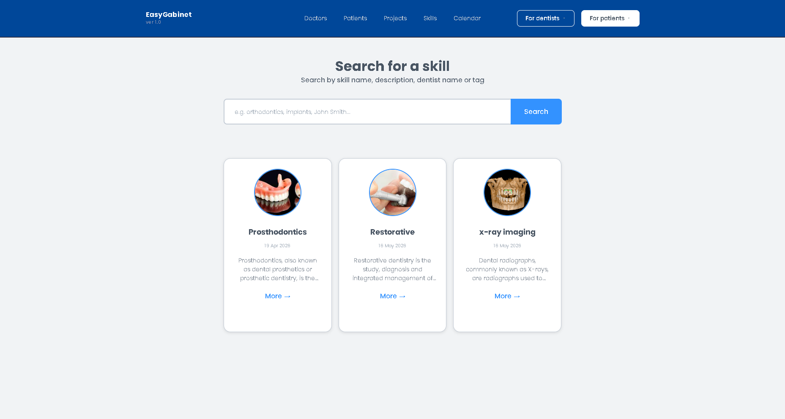
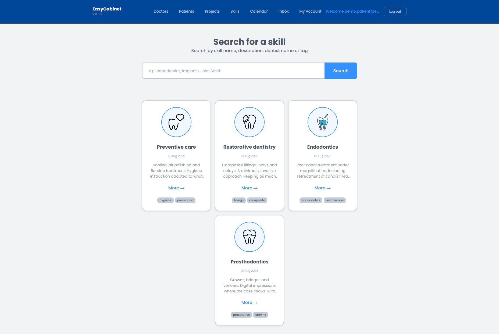
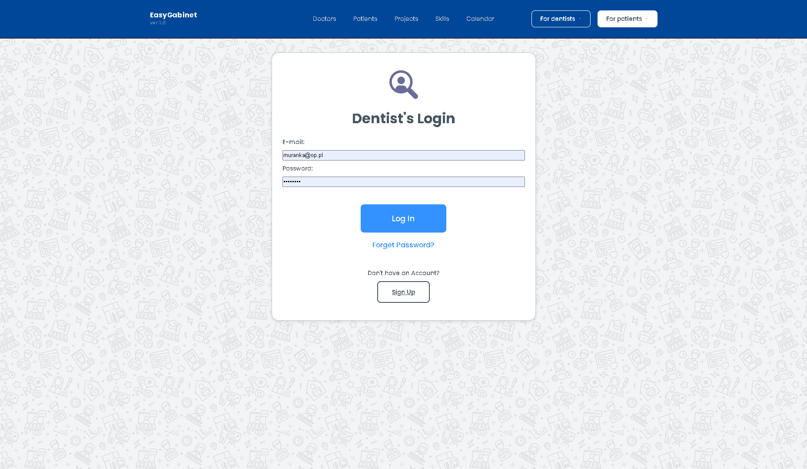
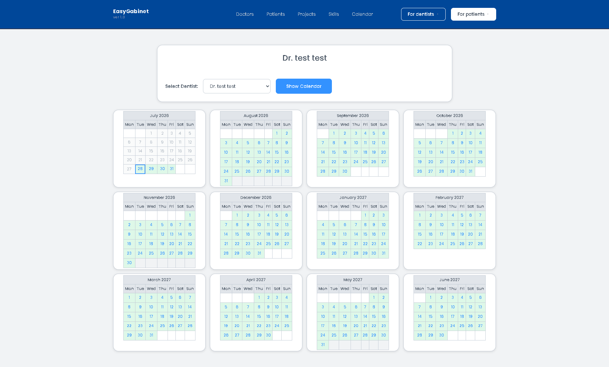
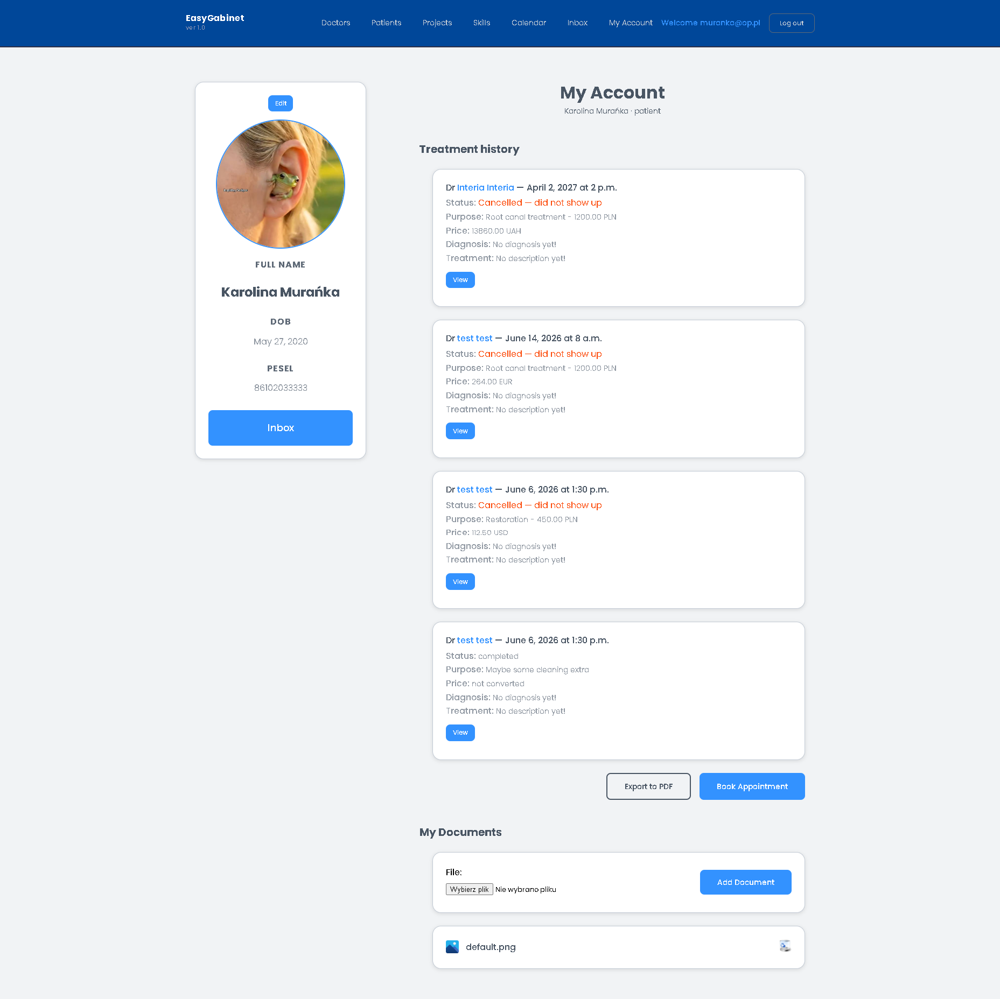
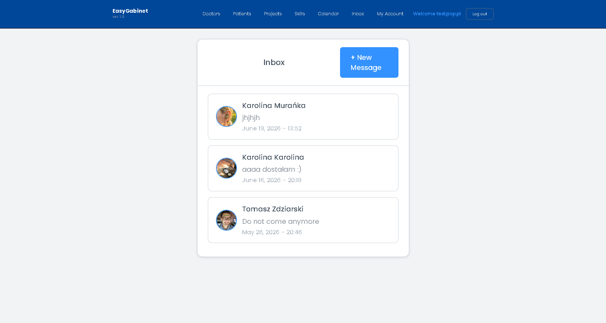
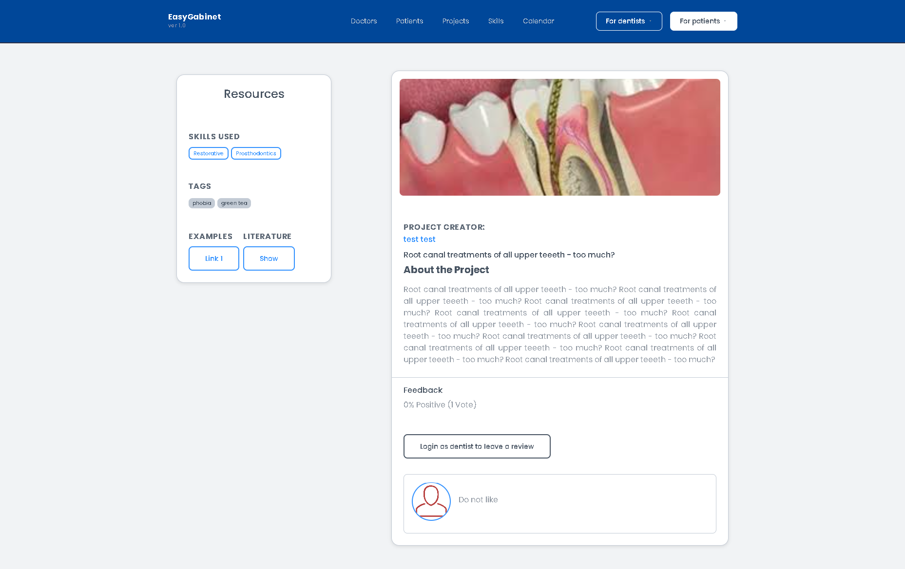

# EasyGabinet

A Django web application for managing a dental clinic — appointment booking, patient records, and communication between dentists and patients.

🔗 **Live demo:** _add your Railway URL here_
👤 **Author:** [Tomasz Zdziarski](https://github.com/TomaszZdziarski)


## Overview

EasyGabinet lets dental patients book, manage, and track their appointments online, while giving dentists a schedule, patient list, and messaging system to run their practice. It was built as a full-stack learning project and now serves as a portfolio piece, covering authentication, booking logic with state transitions, file handling, PDF export, and third-party service integration (email, cloud storage).

## Screenshots

**Home page**



**Login**


**Calendar**


**Patient account**


**Messaging**


**Dentist project page**


## Features

### Patients
- Registration and login, separate from dentist accounts (credentials can't be mixed between the two)
- Required DOB and PESEL (Polish national ID number) with format validation
- Unique email/PESEL enforced at the database level
- Profile editing, profile photo, uploading medical documents (PDF/images)
- Booking up to 3 active appointments at a time
- Cancelling a booking before its scheduled time
- Full treatment history, exportable to PDF
- Two-way messaging with dentists — conversation view, new-message composer, and unread-message badge in the navbar
- Password reset flow

### Dentists
- Own schedule and full patient list for the practice
- Two-way messaging with patients — conversation view, new-message composer, and unread-message badge in the navbar
- Can showcase projects, skills, and articles on their profile, with peer feedback (upvote/downvote + comments) from other dentists
- Password reset flow

### Appointments & scheduling
- Booking logic with a state machine: `available → booked → completed / cancelled / did_not_occur`
- Overlap checking across both patients and dentists to prevent double-booking
- Only dentists can change a booking's status (with `passed` excluded from manual options)
- A responsive **calendar view** built with CSS Grid — full month at a glance, dentist picker, current day highlighted, past days greyed out
- Schedule export to PDF, with timezone-aware date/time handling

### Search & content
- Search across dentist profiles, skills, and projects
- Tagging system for skills and projects

### Notifications
- Auto-dismissing success/error messages (green/red, closable, 4s timeout)

### Admin
- Custom admin panel for staff/operator accounts, with full CRUD over the app's data

## Tech Stack

| Layer | Technology |
|---|---|
| Backend | Python, Django 5.2 |
| Database | PostgreSQL (production), SQLite (local) |
| File storage | AWS S3 (`django-storages`, `boto3`) |
| Email | SendGrid (`django-sendgrid-v5`) |
| PDF generation | ReportLab, WeasyPrint |
| Deployment | Railway — Gunicorn, Whitenoise, `dj-database-url` |
| Frontend | HTML, CSS (custom design system), Bootstrap |

## Getting Started

```bash
git clone https://github.com/TomaszZdziarski/EasyGabinet.git
cd EasyGabinet
python -m venv venv
venv\Scripts\activate        # Windows
pip install -r requirements.txt
```

Create a `.env` file in the project root:

```
SECRET_KEY=your-local-secret-key
DEBUG=True
```

Then:

```bash
python manage.py migrate
python manage.py runserver
```

The app will be available at `http://127.0.0.1:8000/`.

## License

This project was built for educational and portfolio purposes.